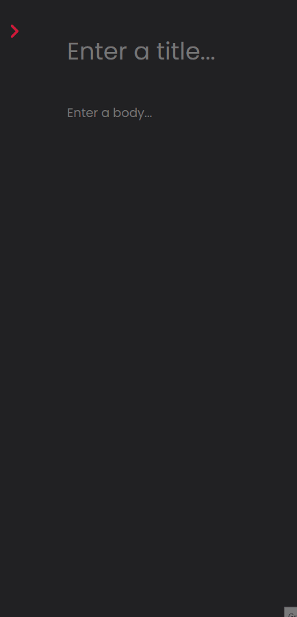

# Notes App
<p>
  
  
</p>

> Status: ✅ Finished

<br/>

## 💻 About The Project

This app lets users create, edit, and delete personal notes directly in the browser. Notes are saved in local storage, so users can access them even after
refreshing or closing the page. It offers a fast and simple interface for organizing thoughts, to-dos, or reminders without needing an account or internet connection.

<br/>

## 🎯 Features
- Create new notes instantly
- Edit existing notes with ease
- Delete notes you no longer need
- Automatically save notes in local storage
- Persistent data — notes stay even after closing the browser

<br/>

## 🌍 See the project

If you want to see the project running in your browser, check it out
<br/>
<br/>
👉  [Working Project](https://notesapplms.vercel.app/)

<br/>

## ⚡Installation

1. Clone this repository: 
   ```bash
   git clone https://github.com/https://github.com/lucasmsaluno/notes-app
   ```
2. Start it with live server on VSCode
  ```bash
   cd path/to/the/prooject live-server
   ```
<br/>

## 📂 Folder Structure
```bash
notesapp/
├── assets/                     # Static files and media
│   └── github/                 # GIFs for README or presentation
│       ├── notesapp.gif
│       └── notesappmobile.gif
├── js/                         # JavaScript files
│   └── app.js                  # Main application logic (NotesApp)
├── styles/                     # CSS styles
│   └── style.css               # Main UI styling
├── index.html                  # Home page of the application


```
<br/>

## ⚙️ Technologies

- HTML5
- CSS3
- Vanilla Javascript
- Font Awesome
